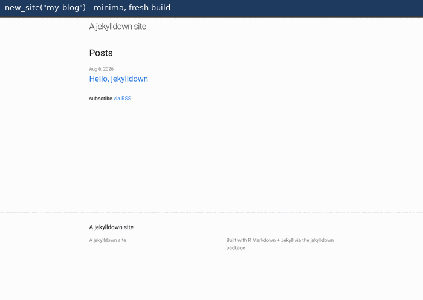
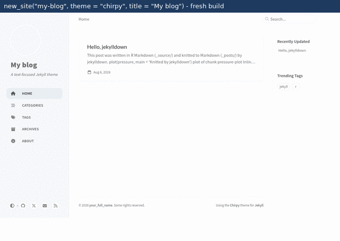

```{r, include = FALSE}
knitr::opts_chunk$set(collapse = TRUE, comment = "#>", eval = FALSE)
```

jekylldown does for [Jekyll](https://jekyllrb.com) what
[blogdown](https://pkgs.rstudio.com/blogdown/) does for Hugo: create,
build, preview, customize, migrate and publish a Jekyll website
entirely from R, writing posts in R Markdown or Quarto. (blogdown
supports Jekyll only in a limited way: the serve-and-reknit loop. Its
site scaffolding, themes and toolchain are designed for Hugo;
jekylldown picks up where that support stops.)

Three things make Jekyll attractive for R users:

* **The theme ecosystem.** The main example is
  [al-folio](https://github.com/alshedivat/al-folio), the reference
  theme for academic sites: publications come from BibTeX, and the CV,
  teaching and news pages are structured data. Hugo has no counterpart
  of comparable adoption.
* **You publish sources, not build artifacts.** GitHub Pages runs
  Jekyll natively and the bundled deploy workflows build the site in
  CI, so the repository holds sources only and publishing is a
  `git push`. There is no `public/` or `_site/` folder to commit.
* **A plain-Markdown contract.** Posts are knitted to Markdown that
  Jekyll consumes directly, and Jekyll runs strictly through its
  command line. There is no R-Ruby bridge and no version coupling to
  break.

```{r}
library(jekylldown)
```

## 1. Check (and maybe skip) the toolchain

```{r}
check()
```

`check()` reports what is available: Ruby, `gem`, `bundler`, `jekyll`,
Quarto, and the current site if you are in one. Two important notes:

* **You do not need Ruby to publish.** Knitting posts only needs R. If
  the site deploys on GitHub Pages/Actions, the Jekyll build runs
  remotely; a local Jekyll is only needed for `serve_site()` previews
  and local `build_site()` builds.
* jekylldown keeps everything it installs in an **isolated toolchain
  directory** (`tools::R_user_dir("jekylldown", "data")`) -- nothing
  system-wide, no shell configuration. On Windows, `install_ruby()`
  sets up Ruby and Jekyll there in one call (on Linux/macOS use your
  package manager, see the README); `install_quarto()` puts the Quarto
  CLI there too. Delete the directory to uninstall.

## 2. Create a site

```{r}
# a minimal blog (minima theme, generated locally, no network needed)
new_site("my-blog")

# the al-folio academic theme, fetched from GitHub, starting empty
new_site("my-site", theme = "al-folio", demo = FALSE)

# the Chirpy technical-blog theme (its starter template, fetched and
# stripped of upstream repo tooling)
new_site("my-blog", theme = "chirpy", title = "My blog")

# Minimal Mistakes, generated locally as a gem-based site
new_site("my-blog", theme = "minimal-mistakes", title = "My blog")
```

This is what the first `build_site()` shows for three of the themes --
each with the sample post the scaffold creates, no edits:






The site is a regular Jekyll site plus one convention: post *sources*
live in `_source/` and are turned into plain Markdown in `_posts/`,
which Jekyll consumes natively.

| Path             | What it is                                        |
|------------------|---------------------------------------------------|
| `_source/*.Rmd`, `*.qmd` | your posts (excluded from the Jekyll build) |
| `_posts/*.md`    | generated output -- do not edit by hand            |
| `assets/img/posts/<post>/` | figures generated by your chunks        |
| `_config.yml`    | the Jekyll configuration                          |

Migrating an existing blogdown/Hugo site instead? See
`vignette("migrate-blogdown-to-al-folio")` -- `migrate_hugo()` converts
posts, pages, menus, publications and more.

## 3. Write posts

```{r}
new_post("My first post", dir = "my-blog", tags = c("r", "notes"))
```

That creates `_source/YYYY-MM-DD-my-first-post.Rmd` with Jekyll front
matter. Write R Markdown as usual: chunks run, figures land in
`assets/img/posts/<post>/` and are linked through `{{ site.baseurl }}`,
and Markdown tables (hand-written or from `knitr::kable()`) are tagged
so the theme styles them.

Three flavors are available:

* **R Markdown via knitr** (default) -- fast, needs nothing beyond R.
* **R Markdown via pandoc** -- add `knit_method: pandoc` to a post's
  front matter (or set `options(jekylldown.knit_method = "pandoc")`)
  to render through rmarkdown/pandoc, which enables citations
  (`bibliography:`), footnotes and cross-references.
* **Quarto** -- `new_post("Title", format = "qmd")`. Rendered with the
  Quarto CLI; install it once with `install_quarto()` if `check()`
  does not find one.

## 4. Build and preview

```{r}
build_site("my-blog")
```

`build_site()` re-knits/re-renders only the sources that are out of
date, then runs `jekyll build` if a local Jekyll exists (otherwise it
just knits, which is all a remote deploy needs).

For themes with a `Gemfile` (al-folio), install the theme's gems once
into the isolated environment; jekylldown then switches to
`bundle exec jekyll` automatically:

```{r}
bundle_install("my-site")
```

Live preview with automatic rebuilds:

```{r}
serve_site("my-blog")
# ... edit and save any watched file: _source/*.Rmd or *.qmd, pages,
# _config.yml, styles -- the site re-knits, rebuilds and reloads
stop_server()
```

## 5. Edit the site afterwards

Everything in the site is a text file; the only rule worth memorizing
is about posts:

* a post with a source in `_source/` (`.Rmd`/`.qmd`) is edited **at the
  source** -- its `.md` twin in `_posts/` is a build artifact and will
  be overwritten on the next build;
* a post that exists only as `_posts/*.md` (created with
  `format = "md"`, or migrated from committed rendered output) *is*
  the source -- edit it directly.

Pages live where the theme expects them, which is also where
`migrate_hugo()` put them:

| Theme | Pages | Menu position |
|-------|-------|---------------|
| al-folio | `_pages/*.md` (`about.md` is the home) | front matter `nav_order` |
| Chirpy | `_tabs/*.md` | front matter `order`, `icon` |
| Minimal Mistakes | `_pages/*.md` | `_data/navigation.yml` |
| minima | site root (`about.md`, `index.md`) | automatic |

Page bodies are plain Markdown (kramdown -- HTML and `{: .class}`
attribute lists work); the front matter between `---` controls title,
`permalink` and menu position.

The home page deserves its own map -- where your name comes from, where
the welcome text goes, and which file decides the social icons shown:

| Theme | Home text | Your name | Social icons |
|-------|-----------|-----------|--------------|
| al-folio | body of `_pages/about.md`; its front matter sets `subtitle` and the photo (`profile.image`) | `first_name`/`middle_name`/`last_name` in `_config.yml` | `_data/socials.yml` -- one key per icon (`github_username`, `orcid_id`, `email`, ...); delete a line to hide that icon; shown because `about.md` has `social: true` |
| Chirpy | `_tabs/about.md` (the home itself is the post feed; the sidebar carries your identity) | `title` and `tagline` in `_config.yml`; photo via `avatar:` | *which* icons: `_data/contact.yml` (one `type:`/`icon:` entry each); *their targets*: `github.username`, `twitter.username` and the `social:` block in `_config.yml` |
| Minimal Mistakes | body of `index.md`, above the post list | `author.name` (plus `avatar`, `bio`) in `_config.yml`; the sidebar shows on pages with `author_profile: true` | the `author.links` list in `_config.yml` -- one `label`/`icon`/`url` entry per icon, add or remove freely |
| minima | body of `index.md` | `title` in `_config.yml` | footer icons from `github_username` and `twitter_username` in `_config.yml` |

`migrate_hugo()` fills all of this from the Hugo site; editing any of
it afterwards is a plain-text change in the file above. Other identity
data: al-folio publications live in `_bibliography/papers.bib` --
adding a paper is pasting its BibTeX entry there.

The practical loop is the live preview: with `serve_site()` running,
save any watched file -- sources, pages, `_config.yml`, data files,
styles -- and the site re-knits what is stale, rebuilds and reloads the
browser. Because jekylldown runs a full `jekyll build` on each change
(instead of `jekyll serve`'s incremental watcher), even `_config.yml`
edits apply live, which classic Jekyll setups need a server restart
for.

One limitation to know: only posts go through the knitting pipeline.
Pages cannot be `.Rmd`/`.qmd` -- if a page needs R output, knit it to
Markdown yourself and paste the result.

## 6. Customize

Customization is layered, most robust first. Everything lands in
managed, idempotent blocks in a site-local stylesheet -- re-run a call to
change or replace it, no hand-written CSS in theme files. (On al-folio,
run `bundle_install()` once first.)

```{r}
# run these from anywhere inside the site's project -- they find the
# site root like build_site(); from outside, add dir = "my-site"

# layer 1 -- the theme's own CSS variables (al-folio and Chirpy;
# dark mode aware). Minimal Mistakes styles through compiled skins
# instead: set_theme_skin("dark")
set_theme_style(
  accent = "red",                     # palette name, #hex or any CSS color
  footer_background = "#222222",
  background = c(light = "#fffdf7", dark = "#1c1c1d"))

# layer 2 -- fonts (Google Fonts faces inlined) and base size
set_theme_font("Lora", size = "17px", code = "JetBrains Mono")

# layer 3 -- one semantic element at a time (see the caveat below)
set_element_style("navbar", background = "#222222", color = "white")
set_element_style("socials", size = "2rem")   # the social icon row

# layer 4 -- the escape hatch: free-form CSS, but in a managed block
add_css(".profile img { border-radius: 50%; }", id = "round-avatar")

# LaTeX math rendering, the way each theme expects it
add_mathjax()

# footer credit ("Built from R with jekylldown X.Y.Z."); new_site()
# adds it already, build_site() keeps the version current
add_footer_credit()     # remove_footer_credit() undoes it
```

## Feeds, and R-Bloggers

Jekyll sites get their Atom feed from the jekyll-feed plugin, which
reads the site title from `title:` in `_config.yml`. al-folio sets
`title: blank` there, a convention its own layouts translate into your
first, middle and last name -- but the plugin does not, so the feed of
a stock al-folio site is titled, literally, "blank". `add_feed()`
renders the feeds from a site-level copy of the plugin's template with
that one case handled (`new_site()` and `migrate_hugo()` call it on
al-folio sites already). The copy is taken from the jekyll-feed gem
installed for the site, the version pinned in `Gemfile.lock`, so it
follows the plugin instead of freezing a copy in the package; the
include records the version it came from, and re-running `add_feed()`
after a gem upgrade regenerates it.

The same call makes per-category feeds, on any theme: `feed/R.xml`
with only the posts whose `categories` include `R`, full text. That is
exactly what [R-Bloggers](https://www.r-bloggers.com/) asks for, so the
whole setup is one call:

```{r}
use_r_bloggers()          # category = "R" by default
```

It writes the R-only feed, adds the link back to R-Bloggers under the
blog header (al-folio; other themes get the snippet printed), and
prints the feed URL to submit at
<https://www.r-bloggers.com/add-your-blog/> once the site is published.
Only posts carrying the category enter the feed --
`new_post("...", categories = "R")` -- which keeps everything else you
write out of the aggregator, as its rules require.

`set_theme_color("red")` remains as a shorthand for setting the accent,
and `set_theme_color(NULL)` removes the override again. For a full
reset, delete the site-local stylesheet (`assets/css/main.scss`;
`assets/main.scss` on minima): it holds only the theme's copy plus the
managed blocks, and is recreated by the next customization call.

All of these functions locate the site root from any directory inside
the site, exactly like `build_site()` -- that is why the examples above
carry no path. To customize a site your R session is *not* in, pass its
location via the `dir` argument, e.g.
`set_theme_color("#b509ac", dir = "my-site")`; called from outside a
site without `dir`, they abort with a message asking for it.

**Layer 3 is the fragile one.** Layers 1-2 go through interfaces the
theme itself maintains (its CSS variables, standard HTML elements), so
they survive theme updates. Layer 3 depends on a curated map of the
theme's selectors (`.navbar`, `footer`, ...), which upstream can rename
in any release -- jekylldown checks the installed theme's sass and warns
when a mapped selector no longer exists, but prefer `set_theme_style()`
whenever a variable covers your case, and drop to `add_css()` when you
need something the maps do not offer.

## 7. Publish on GitHub Pages

1. Push the site to a repository named `youruser.github.io` (include
   `_source/` -- it is excluded from the Jekyll build but belongs in
   version control).
2. al-folio and Chirpy ship their own deploy workflow, but they
   publish differently, so point Pages (repository settings) at the
   matching source:
   - **Chirpy** (`pages-deploy.yml`): *Pages > Source: GitHub
     Actions*.
   - **al-folio** (`deploy.yml`): its workflow pushes the built site
     to a `gh-pages` branch -- *Pages > Source: Deploy from a branch >
     gh-pages / (root)*. With "GitHub Actions" selected the workflow
     runs green but the site never updates.

   For themes without a bundled workflow (minima, Minimal Mistakes),
   `use_pages_workflow("my-site")` writes the standard one (*Source:
   GitHub Actions*); commit the `Gemfile.lock` from `bundle_install()`
   so the workflows can cache gems. (minima also works with the
   classic Pages branch build, no Actions needed.) If the first push
   replaced the branch history (a fresh `git init`), trigger the first
   workflow run by hand: *Actions > the workflow > Run workflow*.
   Other hosts work too -- `_site/` is plain static files; see the
   README's *Publishing* section for Netlify, Cloudflare, GitLab and
   self-hosted setups.
3. Day-to-day: `new_post()`, write, `build_site()` (or just knit with
   `build_site(local_jekyll = FALSE)`), commit, push.
