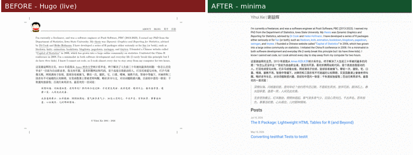
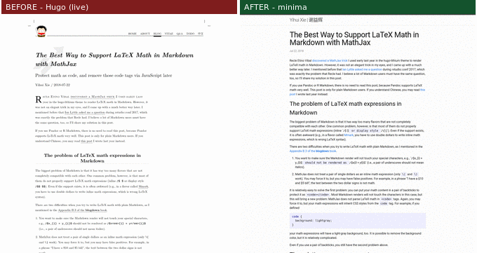
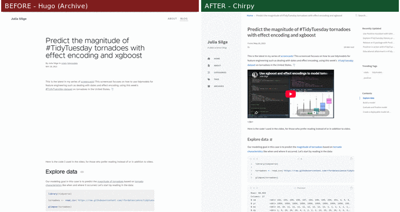
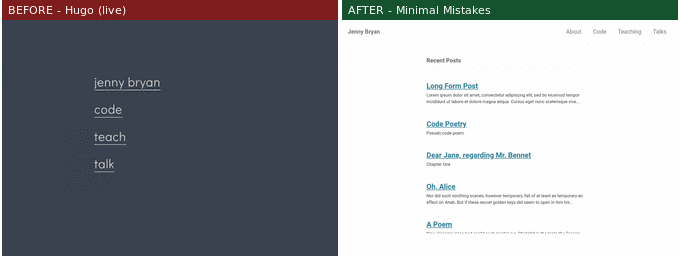
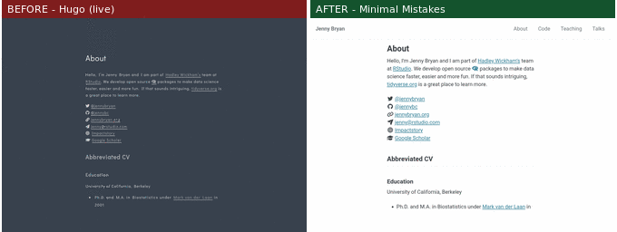
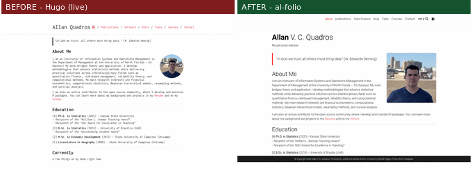
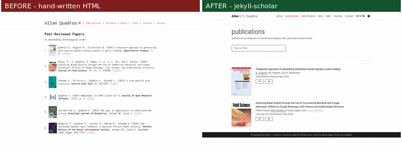
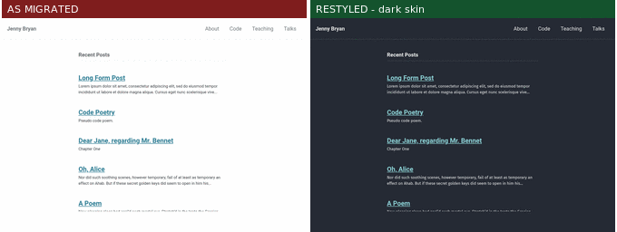
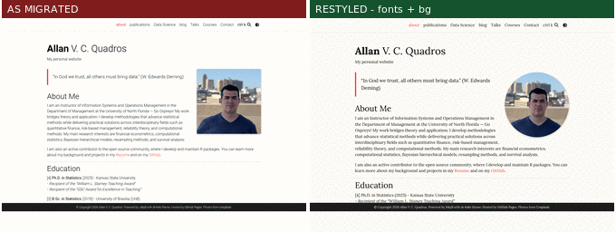

```{r, include = FALSE}
knitr::opts_chunk$set(collapse = TRUE, comment = "#>", eval = FALSE)
```

```{css, echo = FALSE, eval = TRUE}
img { max-width: 100%; height: auto; }
```

How does `migrate_hugo()` behave on *real* sites — not toy fixtures, but
blogdown sites that shaped the R community, with a decade or two of
posts, theme-specific menus and hand-tuned layouts? This vignette
migrates four published blogdown/Hugo sites, one to each supported
theme, and shows the result side by side with the original.

| Site | Author | Hugo theme | Migrated to |
|------|--------|-----------|-------------|
| [yihui.org](https://yihui.org) | Yihui Xie (knitr, blogdown) | hugo-paged | minima |
| [juliasilge.com](https://juliasilge.com) | Julia Silge (tidymodels) | Academic | Chirpy |
| [jennybryan.org](https://jennybryan.org) | Jenny Bryan (tidyverse) | hugo-theme-sam | Minimal Mistakes |
| [allanvc.github.io](https://allanvc.github.io) | Allan Quadros | hugo-researcher | al-folio |

Each migration ran on the site's public source repository, unmodified
(`migrate_hugo()` never writes into the source). The "before" screenshots
come from the published sites (for Julia Silge's, whose live site has
since moved to Quarto, from the Internet Archive's snapshot of the
blogdown era); the "after" screenshots are the migrated sites built
locally with `build_site()`, with no cosmetic fixes between the
migration and the screenshot (the single deviation is disclosed in
Julia Silge's section). All content shown belongs to its authors
and appears here, with links to the originals, only to illustrate the
migration.

One option matters for sites like these:

```{r}
migrate_hugo(from, to, theme = ..., rerender = FALSE)
```

`rerender = FALSE` migrates the *rendered* Markdown that blogdown
committed next to each `.Rmd`/`.Rmarkdown` source, instead of queueing
the sources for re-knitting — the right choice for an archive, where
code from 2008 should not run again in 2026.

## Yihui Xie → minima

The creator of knitr and blogdown, and 19 years of posts:

```{r}
migrate_hugo("yihui.org", "yihui-minima", theme = "minima",
             only_referenced = TRUE, rerender = FALSE)
#> ✔ 1884 posts migrated
```

**1884 posts** came through, Jekyll built all of them, and the spirit of
the original — radical minimalism — survives in minima:



The stress test hiding in this site: posts *about* LaTeX and templating
contain literal `{{` sequences, which Jekyll's Liquid engine treats as
template tags — one such post aborts the entire 1884-post build.
`migrate_hugo()` escapes them automatically (your own
`{{ site.baseurl }}` links are left alone):



What stayed manual, from the migration report: yihui.org is bilingual,
and both languages land in one post feed (per-language sites need
curation).

One more thing a statistician's archive needs: minima ships no MathJax,
so LaTeX math renders as raw text. One call fixes it — theme-aware, so
the same function flips al-folio's native flag, enables Chirpy's
per-page math site-wide, or (as here, on minima) inserts a configured
MathJax script into a site-local copy of the theme's head:

```{r}
add_mathjax("yihui-minima")
build_site("yihui-minima")
```


## Julia Silge → Chirpy

A data-science screencast blog on the old Hugo Academic theme — heavy
on code, plots and embedded videos:

```{r}
migrate_hugo("juliasilge.com", "julia-chirpy", theme = "chirpy",
             only_referenced = TRUE, rerender = FALSE)
#> ✔ 164 posts migrated
```

Academic's `[[menu.header]]` (instead of Hugo's standard `menu.main`)
is understood, 123 posts arrive pre-rendered thanks to
`rerender = FALSE`, and 81 `{}` shortcodes — the
percent-delimited form, with quoted arguments — become embedded
players:


A typical screencast post. One reading note: the "before" comes from
the Internet Archive, which does not archive YouTube iframes — the
blank block on the left is where the original page showed the video.
On the migrated site (right) the converted embed renders the same
video again:



Blogdown's rendered posts wrap figure paths in
`` tags; those are resolved away during
migration, so images point at the copied assets.

Full disclosure, and a practical note: 41 posts had no committed
rendered output, so `rerender = FALSE` left their `.Rmd` sources in
`_source/` for re-knitting. Re-executing years-old code was not
realistic for this demonstration, so those 41 files were removed
before the build — on a real migration you would knit the ones you
care about and drop the rest.

## Jenny Bryan → Minimal Mistakes

A minimalist personal site on hugo-theme-sam, which keeps its menu in
`[[params.mainMenu]]` with `link`/`text` keys — nowhere near Hugo's
menu convention. The fallback finds it:

```{r}
migrate_hugo("jennybryan.org", "jenny-mm", theme = "minimal-mistakes",
             only_referenced = TRUE, rerender = FALSE)
```

The four menu pages become `_pages/` entries wired into
`_data/navigation.yml`, and the GitHub/Scholar profiles found in the
content move into Minimal Mistakes' author sidebar:





## Allan Quadros → al-folio

The migration this package was born for — an academic site with a
hand-written publications page:

```{r}
migrate_hugo("my_webpage", "my-new-site", theme = "al-folio",
             only_referenced = TRUE, publications = "bib",
             theme_color = "red")
```



`publications = "bib"` is the deterministic showpiece: the DOIs on the
hand-written page are extracted, each reference is fetched as
authoritative BibTeX from doi.org, journal covers are paired with their
entries, and al-folio's jekyll-scholar renders the result — filter box,
DOI/Bib buttons and highlighted author name included:



## Beyond the migration: make it yours

A migration lands on the theme's defaults. The customization layers
(see `vignette("jekylldown")`, section 5) take it from "migrated" to
"mine" without hand-written CSS — everything below is package
functions plus, where noted, one config line. Left: as migrated.
Right: after the recipe.

**Julia Silge / Chirpy** — the theme's CSS variables, plus the one
manual item the report left us. Academic kept her portrait as author
data, so we copy it in and point Chirpy's `avatar:` at it:

```{r}
set_theme_style("julia-chirpy",
  accent = "#8e24aa",   # a nod to Academic's purple
  sidebar_background = c(light = "#f6eef8", dark = "#1d1428"))
```

```{r, eval = FALSE}
# the avatar: copy the image, set one config key
file.copy("juliasilge.com/content/about/sidebar/avatar.jpg",
          "julia-chirpy/assets/img/avatar.jpg")
# in _config.yml:  avatar: /assets/img/avatar.jpg
```


**Jenny Bryan / Minimal Mistakes** — no CSS variables here; the theme
restyles through compiled skins, plus a Google Font inlined by
`set_theme_font()`:

```{r}
set_theme_skin("jenny-mm", "dark")
set_theme_font("jenny-mm", family = "Fira Sans")
```



**Allan Quadros / al-folio** — fonts, a warmer background per color
scheme, and a free-form touch in a managed block:

```{r}
set_theme_font("allan-alfolio", family = "Lora", size = "17px")
set_theme_style("allan-alfolio",
  background = c(light = "#fffdf7", dark = "#1c1c1d"))
add_css("allan-alfolio", ".profile img { border-radius: 50%; }",
        id = "round-avatar")
```



Every one of these blocks is idempotent — re-run with other values to
change your mind, or remove it (e.g. `add_css(site, character(0),
id = "round-avatar")`). On minima the same `set_theme_font()`,
`add_css()` and `add_mathjax()` (shown in Yihui Xie's section) work
unchanged; only the variable layer is theme-specific.

## What to take from the gallery

* Real sites diverge from Hugo conventions in the config (`config.yaml`,
  `[[menu.header]]`, `[[params.mainMenu]]`), in the content layout
  (multilingual `content/en/`, page bundles) and in the shortcodes
  (`{}` vs ``) — `migrate_hugo()` handles all of the above,
  and prints a report of what it could not convert.
* For archives, `rerender = FALSE` is the difference between a build
  that works and a build that tries to execute a decade of old chunks.
* The migration is only the first pass: each report listed a few items
  for hand-porting (custom shortcodes, `layouts/` overrides), and the
  aesthetics are one function call away (`set_theme_style()`,
  `set_theme_skin()`, `set_theme_font()`, `add_mathjax()`, `add_css()`).
  The point is that the mechanical 99% — posts, pages, menus, assets,
  identity, socials — arrives working.
